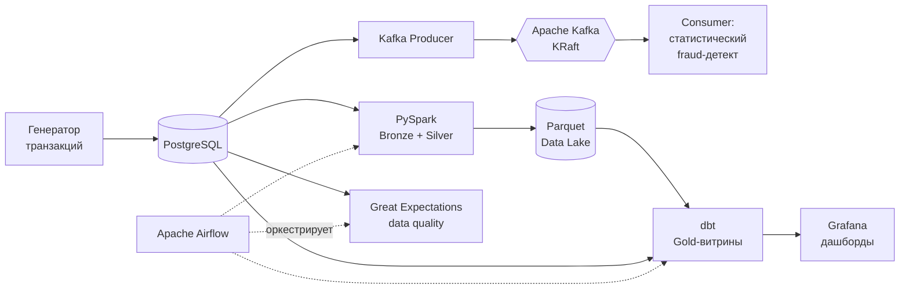

# FinFlow — Real-Time Financial Analytics Platform

End-to-end data engineering платформа: генерирует поток финансовых
транзакций, проводит их через стриминговый и batch-контур, строит
аналитические витрины и контролирует качество данных на каждом шаге.
Весь стек поднимается локально одной командой через Docker Compose.

Проект — учебный (pet-проект), но собран по принципам production: слои
Medallion, оркестрация, тесты данных, статистический контроль и CI.

---

## Архитектура



**Слои данных (Medallion Architecture)**

| Слой | Что лежит | Чем строится |
|------|-----------|--------------|
| **Bronze** | Сырые данные из Postgres, как есть → Parquet | PySpark |
| **Silver** | Очищенные, дедуплицированные, обогащённые данные + derived-колонки, партиционирование по `category` | PySpark |
| **Gold** | Аналитические витрины: дневные агрегаты, метрики пользователей, скоринг аномалий | dbt |

---

## Стек технологий

| Слой | Технология | Зачем |
|------|-----------|-------|
| Источник | PostgreSQL 15 | Хранение транзакций и пользователей |
| Стриминг | Apache Kafka 3.7 (KRaft) | Real-time поток событий без Zookeeper |
| Batch-обработка | Apache Spark 3.5 (PySpark) | ETL, Bronze/Silver трансформации |
| Трансформации | dbt-core 1.8 | Gold-витрины, тесты, документация, инкрементальные модели |
| Оркестрация | Apache Airflow 2.9 | Ежедневный пайплайн, зависимости задач, retry |
| Качество данных | Great Expectations 0.18 | Валидация схемы и бизнес-правил на входе |
| Мониторинг | Grafana 10 | Провижининг дашбордов и датасорса |
| CI/CD | GitHub Actions | flake8, pytest, dbt build, Great Expectations на каждый PR |
| Контейнеризация | Docker + Docker Compose | Весь стек локально, воспроизводимо |

---

## Статистический fraud-детект

Отдельно стоит выделить подход к обнаружению мошеннических транзакций —
здесь задействован математический аппарат, а не просто чтение готовой
метки `is_fraud`.

**Потоковый детектор (`ingestion/stats.py` + `consumer.py`)**
- Среднее и дисперсия по каждому пользователю считаются онлайн
  **алгоритмом Уэлфорда** — за один проход, O(1) памяти, численно
  устойчиво.
- Транзакция помечается аномальной по **Z-оценке** относительно истории
  пользователя или глобального распределения (порог 3.0 ≈ правило трёх
  сигм).
- Метка `is_fraud` из генератора в принятии решения **не участвует** —
  детектор работает «вслепую». По метке считаются **precision / recall /
  F1** и матрица ошибок: видно, насколько статистика совпала с разметкой.

**dbt-модель `transaction_anomalies`**
- Для каждой транзакции — две оценки выброса относительно истории
  пользователя: классическая **Z-оценка** и робастная **modified
  z-score** на медиане и **MAD** (median absolute deviation).
- Робастная оценка устойчива к самим выбросам — опирается на квантили,
  а не на среднее; константа 0.6745 приводит MAD к σ нормального
  распределения.

---

## Быстрый старт

**Требования:** Docker Desktop, Python 3.11+ (для запуска dbt с хоста).

```bash
git clone https://github.com/umar1593/finflow.git
cd finflow
cp .env.example .env          # при необходимости поправить значения
docker compose up -d          # postgres, kafka, генератор, producer, consumer, grafana
```

Сервисы после запуска:
- **Adminer** (UI для Postgres) — http://localhost:8080
- **Kafka UI** — http://localhost:8081
- **Grafana** (дашборд FinFlow Overview) — http://localhost:3000 — `admin / admin123`

**Spark (Bronze + Silver):**
```bash
docker compose --profile spark run --rm spark
```

**dbt (Gold-слой):**
```bash
cd dbt_project
dbt deps && dbt build --profiles-dir .
dbt docs generate && dbt docs serve --port 8082
```

**Great Expectations (data quality):**
```bash
docker compose --profile gx run --rm gx-validate
```

**Airflow (оркестрация всего пайплайна):**
```bash
docker compose --profile airflow up -d airflow
```
Airflow UI — http://localhost:8083 — `admin / admin123`.

---

## Структура проекта

```
finflow/
├── ingestion/
│   ├── generator.py          # генератор синтетических транзакций
│   ├── producer.py           # Kafka producer (Postgres → топик)
│   ├── consumer.py           # Kafka consumer со статистическим fraud-детектом
│   ├── stats.py              # Welford, Z-score, IQR, матрица ошибок
│   ├── schema.sql            # схема БД
│   └── seed_sample.sql       # детерминированный датасет для CI
├── spark/
│   └── transform.py          # PySpark Bronze/Silver трансформации
├── dbt_project/
│   ├── models/
│   │   ├── staging/          # stg_transactions (view)
│   │   └── marts/            # daily_summary (incremental), user_metrics,
│   │                         # transaction_anomalies
│   ├── macros/               # кастомный generic-тест not_negative
│   ├── tests/                # singular-тест: контроль доли фрода
│   ├── packages.yml          # dbt_utils
│   └── profiles.yml          # подключение через env-переменные
├── expectations/
│   ├── validate.py           # наборы ожиданий Great Expectations
│   └── README.md             # описание data-quality слоя
├── dags/
│   └── finflow_dag.py        # Airflow DAG (полный граф задач)
├── airflow/
│   └── Dockerfile            # кастомный образ Airflow (Spark + dbt + GE)
├── grafana/
│   ├── datasource.yml        # автоподключение к Postgres
│   ├── dashboards.yml        # провижининг дашбордов
│   └── dashboards/           # FinFlow Overview (JSON)
├── tests/                    # pytest: тесты stats.py и generator.py
├── .github/workflows/ci.yml  # CI pipeline
├── .env.example
└── docker-compose.yml
```

---

## Ключевые инженерные решения

**KRaft вместо Zookeeper.** Kafka 3.7 в режиме KRaft управляет
метаданными сама — Zookeeper deprecated в Kafka 3.x.

**ELT вместо ETL.** Данные сначала загружаются в Bronze как есть, потом
трансформируются. При изменении бизнес-логики можно переобработать
историю с нуля.

**Инкрементальная витрина `daily_summary`.** При повторном запуске
пересчитываются только последние сутки; `unique_key` обеспечивает merge,
поэтому поздно пришедшие данные не теряются.

**Partition pruning.** Silver партиционирован по `category` — запрос по
одной категории читает 1/8 данных.

**Изолированные venv в образе Airflow.** Spark, dbt и Great Expectations
имеют конфликтующие пины зависимостей. dbt и GE ставятся в отдельные
venv, DAG вызывает их по абсолютному пути к интерпретатору — образ
самодостаточный, без проблем с разрешением версий.

**Атомарная запись Spark.** Файл `_SUCCESS` сигнализирует об успешном
завершении джоба; при сбое данные не повреждаются.

---

## Качество данных и тесты

| Уровень | Чем проверяется | Что покрывает |
|---------|-----------------|---------------|
| Unit-тесты | pytest (`tests/`) | алгоритм Уэлфорда vs stdlib, IQR, детектор, матрица ошибок, инварианты генератора |
| Данные на входе | Great Expectations | целостность ключей, диапазоны сумм, бизнес-справочники, доля фрода |
| Модели dbt | generic + singular тесты | `unique`, `not_null`, `accepted_values`, `dbt_utils.accepted_range`, кастомный `not_negative`, контроль доли фрода |
| Пайплайн | Airflow | наличие свежих данных, отсутствие orphan-транзакций, порог fraud-rate |

**CI на каждый PR в `main`:** flake8 → pytest → `dbt build` против реального
Postgres → прогон наборов Great Expectations.

---

## Данные

Синтетические данные от встроенного генератора:
- 100 пользователей из разных стран, ~2 транзакции/сек;
- 8 категорий: groceries, electronics, dining, travel, healthcare,
  clothing, entertainment, utilities;
- ~3% транзакций размечены как фрод (нетипично крупные суммы $500–$5000).

---

## Ограничения и что дальше

Проект осознанно упрощён под локальный стенд. В production-варианте
стоило бы:
- запускать Spark и dbt отдельными воркерами (или через
  `KubernetesPodOperator`), а не внутри образа Airflow;
- хранить секреты в Secrets Manager / Airflow Connections, а не в
  `docker-compose.yml`;
- вести смещения Kafka producer'а персистентно (сейчас — в памяти);
- добавить snapshot'ы dbt для SCD-2 и тесты свежести (`source freshness`).

---

## Автор

**Умар Ширваниев** — магистр прикладной математики (РУДН).
GitHub: [github.com/umar1593](https://github.com/umar1593)
